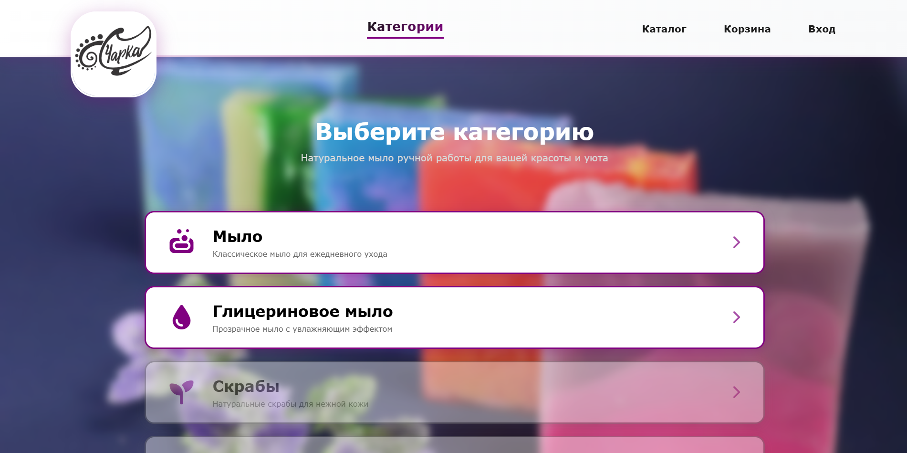
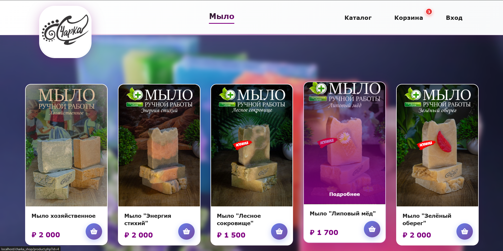
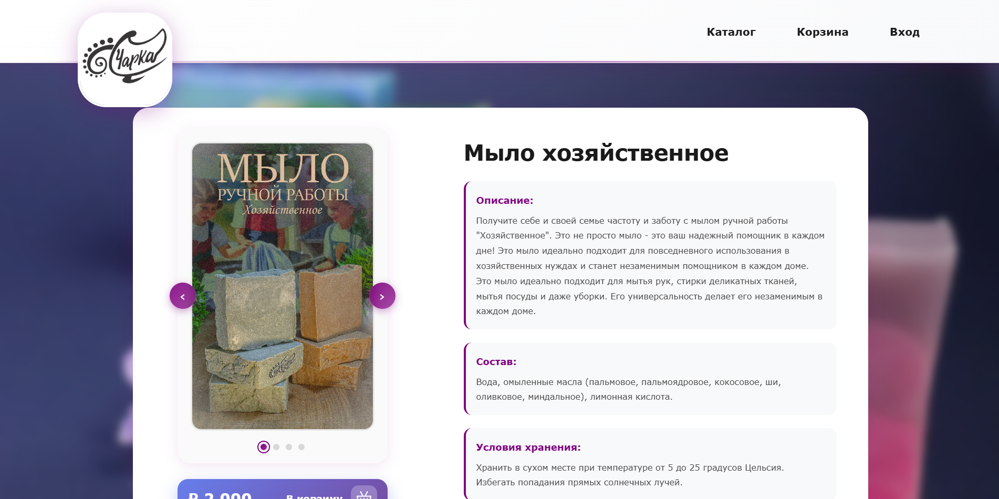
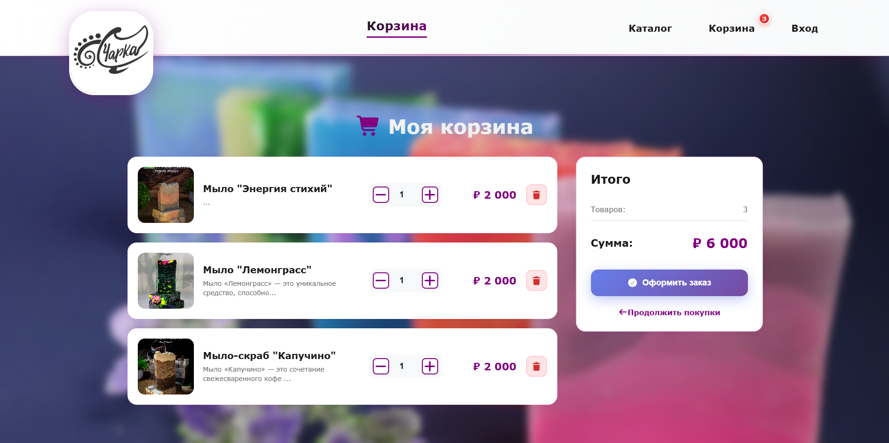

# Интернет-магазин Charka Shop

Полноценный интернет-магазин с каталогом товаров, подробными карточками, корзиной (гостевая + для авторизованных пользователей), регистрацией/логином и уведомлениями о новых заказах в Telegram-бота. Реальный проект, который будет использоваться моей тетей для продаж.

## Стек технологий
**PHP-версия (v1):**  
- Frontend: HTML5, CSS3 
- Backend: PHP + MySQL
- Интеграции: Telegram Bot API  
- Локальный сервер: XAMPP

**Django-версия (v2, в процессе):**  
- Python + Django  
- PostgreSQL

## Функционал
- Категории товаров
- Подробные карточки товаров (фото, описание, характеристики, цена)
- Корзина (гостевая и для аккаунтов)
- Регистрация и вход по логину/паролю
- Оформление заказа с заполнением данных
- Автоматическая отправка информации о заказе в Telegram-бот администратору
- Система отзывов
- Админ панель (пока что неполноценный отдельный аккаунт с расширенными правами)

## Скриншоты
### Главная страница

### Каталог

### Страница товара

### Корзина

## Как запустить локально на XAMPP
1. Склонировать репозиторий
2. Положить папку проекта в htdocs XAMPP
3. Запустить Apache и MySQL через control.exe в корневой папке
4. Импортировать базу данных
5. Открыть в браузере http://localhost/папка

## Честное примечание
Frontend (вёрстка, формы, адаптив, карточки, корзина) — сделан мной самостоятельно.  
Backend-логика написана с активной помощью Claude AI для ускорения разработки. Я формулировал требования, корректировал генерируемый код, тестировал все мелочи и логику кода полностью понимаю.

## Планы
- Backend на Django
- История заказов
- Полноценная админка c возможностью добавлять/удалять товар, мониторингом заказов и изменением их статусов
- Мелкие доработки по UI составляющей